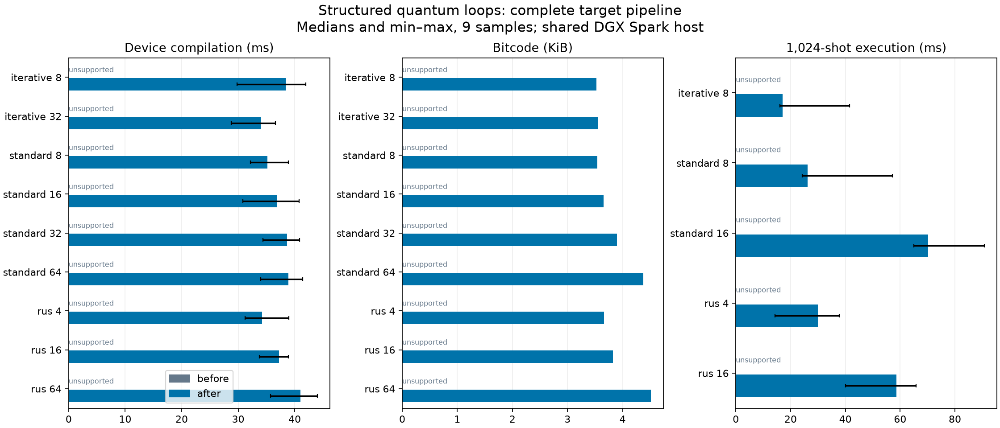
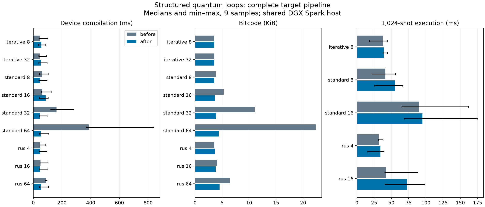

# Indexed placement measurements

## Upstream comparison at `a66a9b206`

The complete device pipeline was rebuilt at main
`a66a9b20698d5a7450541002a8122352d8275957` and implementation
`ca09dc2cacf86e8f6dc8a84aad4a764ae60ba585`. Both use identical saved QC inputs,
query the packaged DDSIM target, and select its Adaptive QIR payload.
CPython 3.14.7, GCC 13, LLVM/MLIR 23.1.0, MinSizeRel with IPO disabled, DGX Spark
AArch64. Native module and input hashes are recorded in each raw JSON file.
The later rebase onto PR #2519 updates compiler naming. The values below remain
measurements of the listed revisions; timings were not rerun for that rebase.

All nine inputs are unsupported at that upstream revision: iterative QPE reaches
the missing classical-tensor lowering; standard QPE and RUS reach the mapper's
flat QTensor-chain diagnostic. Every input succeeds with the implementation. Failed
compilations are recorded separately and are never plotted as successful
compilation times. This comparison establishes added support, not a speedup
over that upstream revision.

Three alternating before/after batches contain three samples each: nine per
input and revision. The after results below are median [minimum, maximum]
milliseconds. Execution includes submission, JIT/job setup, waiting, and counts
retrieval, using 1,024 shots and seed 17. Every executed QPE/RUS sample is checked
against its analytic reference; QPE has phase 3/8 and RUS has TVD below 0.03.
Widths 32 and 64 are compile-only. The shared host has timing variation.

| Input | Compile after (ms) | Bitcode bytes | Execute after (ms) |
| --- | --- | --- | --- |
| iterative 8 | 38.40 [29.76, 41.96] | 3,612 | 17.11 [16.10, 41.59] |
| iterative 32 | 33.95 [28.78, 36.60] | 3,632 | - |
| standard 8 | 35.14 [32.16, 38.85] | 3,624 | 26.24 [24.27, 57.15] |
| standard 16 | 36.84 [30.83, 40.75] | 3,740 | 70.16 [65.01, 90.83] |
| standard 32 | 38.68 [34.39, 40.84] | 3,988 | - |
| standard 64 | 38.90 [34.00, 41.42] | 4,480 | - |
| rus 4 | 34.26 [31.26, 38.95] | 3,748 | 29.94 [14.38, 37.74] |
| rus 16 | 37.21 [33.76, 38.88] | 3,916 | 58.72 [40.00, 65.79] |
| rus 64 | 41.05 [35.76, 44.03] | 4,624 | - |



The historical measurements below compare successful compilations before the
stricter upstream checks. They remain useful evidence of the code-size and
execution tradeoff, but their speedups must not be attributed to that baseline.

### Reproduce the saved comparison

Build each revision in a separate environment with the configuration above.
The Python build uses
`SKBUILD_CMAKE_ARGS='-DENABLE_IPO=OFF;-DBUILD_MQT_CORE_DOCUMENTATION=ON;-DBUILD_MQT_CORE_QDMI_SC_DEVICE=OFF'`
and `SKBUILD_CMAKE_BUILD_TYPE=MinSizeRel`; confirm `ENABLE_IPO=OFF` in both build
caches. Force package reinstallation after changing C++ sources. Use the retained
`matched_probe.py` from this branch for both installed versions. Set
`MQT_CORE_QDMI_CONFIG_JSON` and the file named by `MQT_CORE_QDMI_CONFIG_FILE` to
`{"schema-version":1,"qdmi":{"devices":[]}}` so only packaged devices are used.
Run three alternating before/after batches:

```sh
/path/to/environment/bin/python .agent/benchmarks/compiler-placement/matched_probe.py \
  --label FULL_REVISION --output .agent/benchmarks/compiler-placement/upstream-before-1.json --repeats 3
uv run --no-project --with matplotlib python .agent/benchmarks/compiler-placement/summarize.py --prefix upstream
```

Use `upstream-after-N.json` for the implementation and `N=1,2,3` for each batch.
The harness retains errors from unsupported inputs; the summary checks input
hashes, native module hashes, and stable output sizes across successful runs.
The retained constant-slot and partial-release MLIR inputs provide small
standalone reproductions. Native tests own their regression coverage.

## Historical successful-compilation comparison

The matched comparison uses the complete device-directed compilation pipeline
and identical saved QC inputs. Both versions query the packaged DDSIM target,
perform placement and synthesis, and produce Adaptive QIR.

- Before: `7fca20764e0f4b4fbb995fd6e2f759c74275c6c1`.
- After: `a1d7ec8ccb7a6489b731197ef94eba90de3f44f6` (implementation before the final upstream rebase).
- CPython 3.14.7, GCC 13, LLVM/MLIR 23.1.0, MinSizeRel Python extensions,
  DGX Spark AArch64. Exact platform and native module SHA-256 hashes are in each
  raw JSON file. Later formatting, dialect registration, and lint fixes do not
  affect these measured paths.
- Three alternating before/after batches, three samples each: nine samples per
  workload and variant. This shared host also ran other builds. Ranges show the
  resulting timing variation; small differences are not evidence of speedups.
- Execution includes submission, JIT/job setup, waiting, and counts retrieval.
  Each sample uses 1,024 shots and seed 17. QPE returns the exact phase 3/8; RUS
  is checked against the analytic parity distribution with TVD below 0.03.
  Widths 32 and 64 are compile-only. This is not a runtime simulator benchmark.

Values are median [minimum, maximum] milliseconds; bytes are before / after.

| Input | Compile before | Compile after | Bitcode bytes | Execute before | Execute after |
| --- | ---: | ---: | ---: | ---: | ---: |
| iterative 8 | 47.64 [39.11, 102.14] | 55.77 [36.66, 86.33] | 3612 / 3612 | 37.89 [18.25, 44.26] | 39.10 [37.84, 44.65] |
| iterative 32 | 44.26 [37.42, 92.90] | 52.63 [37.31, 97.07] | 3632 / 3632 | - | - |
| standard 8 | 60.87 [42.29, 104.36] | 46.32 [38.53, 97.18] | 3888 / 3624 | 41.33 [22.01, 56.05] | 55.18 [25.71, 66.27] |
| standard 16 | 62.59 [57.17, 127.84] | 85.99 [42.79, 104.41] | 5424 / 3740 | 90.25 [65.23, 161.85] | 95.14 [69.03, 174.92] |
| standard 32 | 161.22 [120.29, 280.52] | 44.82 [43.40, 96.47] | 11332 / 3988 | - | - |
| standard 64 | 386.36 [368.17, 840.71] | 51.09 [43.69, 106.84] | 22876 / 4480 | - | - |
| rus 4 | 47.87 [39.70, 86.58] | 46.73 [39.94, 95.38] | 3640 / 3748 | 32.05 [31.34, 37.90] | 34.17 [15.76, 39.45] |
| rus 16 | 50.22 [47.64, 103.04] | 45.24 [40.75, 102.01] | 4184 / 3916 | 42.53 [40.29, 88.26] | 72.84 [40.63, 98.74] |
| rus 64 | 89.44 [82.78, 97.46] | 53.46 [42.94, 106.39] | 6612 / 4624 | - | - |



Standard QPE at width 64 has a clear compilation and size improvement. There is
no universal runtime improvement: loops add execution work, and RUS at width 16
has a higher execution median here. RUS at width 4 also grows slightly in bytecode.
The site table still grows linearly with register width. The long-loop native
regression separately verifies that 100,001 iterations retain one loop body.

### Reproduce the historical comparison

Build each measured revision in a separate environment using the same
MinSizeRel configuration. The compressed patches preserve the measured source
across rebases: apply `measured-before.patch.gz` to `ad74680f1` for the baseline,
then `measured-after.patch.gz` for the replacement (decompress with `gzip -dc`
and pass the result to `git apply`). Use an empty QDMI configuration file and set
`MQT_CORE_QDMI_CONFIG_JSON` to `{"schema-version":1,"qdmi":{"devices":[]}}`.
The packaged DDSIM device remains available. Run, alternating variants for each
of three batches:

```sh
/path/to/environment/bin/python .agent/benchmarks/compiler-placement/matched_probe.py \
  --label FULL_REVISION --output .agent/benchmarks/compiler-placement/matched-before-1.json --repeats 3
uv run --no-project --with matplotlib python .agent/benchmarks/compiler-placement/summarize.py
```

Use `matched-after-N.json` for the after variant and N=1,2,3 for the batches.
`matched_probe.py` verifies output quality on every executed sample;
`summarize.py` checks matching input hashes and stable module hashes within each
variant. Matplotlib is needed only for this one-off plot, not by MQT Core.


The superseded device-versus-direct diagnostic scripts, raw runs, and generated
LLVM snapshots remain in Git history at `13f94a920`. They are not part of this
benchmark: one arm skipped target passes. Current native tests retain the
ownership and long-loop regressions they exposed.
