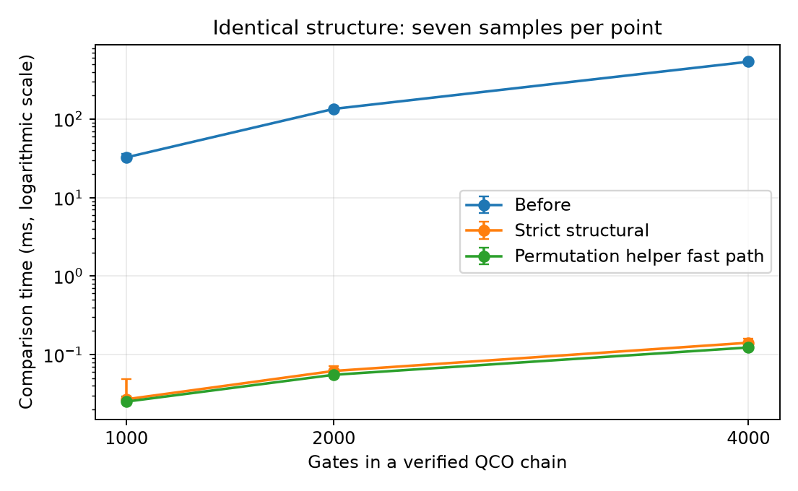

# PR #2502 comparator experiment

Date: 2026-09-10. Baseline: `db95f4817b2498fd5c60e4cf7bf0f23accb81b24`.
Candidate: `39b5ecd71ff7010a829dcb58878a7ae1261ac9c2`. These measurements
predate the upstream rebase and tensor-permutation follow-up.
Host: native ARM64 DGX Spark. Build: Clang 23, LLVM/MLIR 23.1.0,
Release, ThinLTO, mold, `release-clang-ipo` local preset.

## Workload and result

Two separately parsed modules share one MLIR context. Each contains a function
with a chain of QCO Hadamard gates. MLIR verification and QCO linearity pass
before timing; every comparison result must be true. Parsing and verification
are untimed. The baseline implementation and both candidate entry points are
linked into the same optimized executable. Seven unfiltered samples per size
run in baseline, strict, then permutation-helper order.

| Gates | Baseline median (ms) | Baseline min–max | Strict median (ms) | Strict min–max | Permutation median (ms) | Permutation min–max |
| ---: | ---: | ---: | ---: | ---: | ---: | ---: |
| 1,000 | 32.5163 | 32.3765–36.0666 | 0.026896 | 0.026080–0.048496 | 0.025121 | 0.024704–0.028976 |
| 2,000 | 134.899 | 133.848–135.886 | 0.061712 | 0.058705–0.071025 | 0.055153 | 0.054240–0.061441 |
| 4,000 | 538.385 | 535.649–539.976 | 0.141313 | 0.135649–0.159890 | 0.122945 | 0.117841–0.132449 |

Strict comparison uses upstream `OperationEquivalence` with consistent SSA
mapping. The permutation helper tries this first, avoiding repeated readiness
scans for identical structure. These results establish the improvement for
that workload only. Permutation fallback still uses greedy matching and can
perform quadratic work; no production compiler or total CI speedup is claimed.
The small difference between candidate entry points is affected by cache/order.

## Reproduction

Use a disposable checkout with a configured Release build. This harness stays
outside ordinary test targets. Temporarily append the following line to
`mlir/unittests/CMakeLists.txt`:

```cmake
include("${PROJECT_SOURCE_DIR}/.agent/benchmarks/pr2502-comparator/benchmark.cmake")
```

Then run:

```sh
cmake --build --preset release-clang-ipo --target pr2502-comparator -j8
build/release-clang-ipo/mlir/unittests/pr2502-comparator > timings.csv
```

`benchmark.cmake` extracts the exact baseline with `git show`, renames its
entry point at compilation, and links both versions into the harness. The
recorded run exits 0. Remove the temporary include and reconfigure afterward.
Use any equivalent optimized preset when the local preset is unavailable.

- [Harness](comparator.cpp) and [build recipe](benchmark.cmake)
- [Raw samples](timings.csv)
- [Plot generator](plot.py): `uv run --no-project --with matplotlib python3 plot.py`


