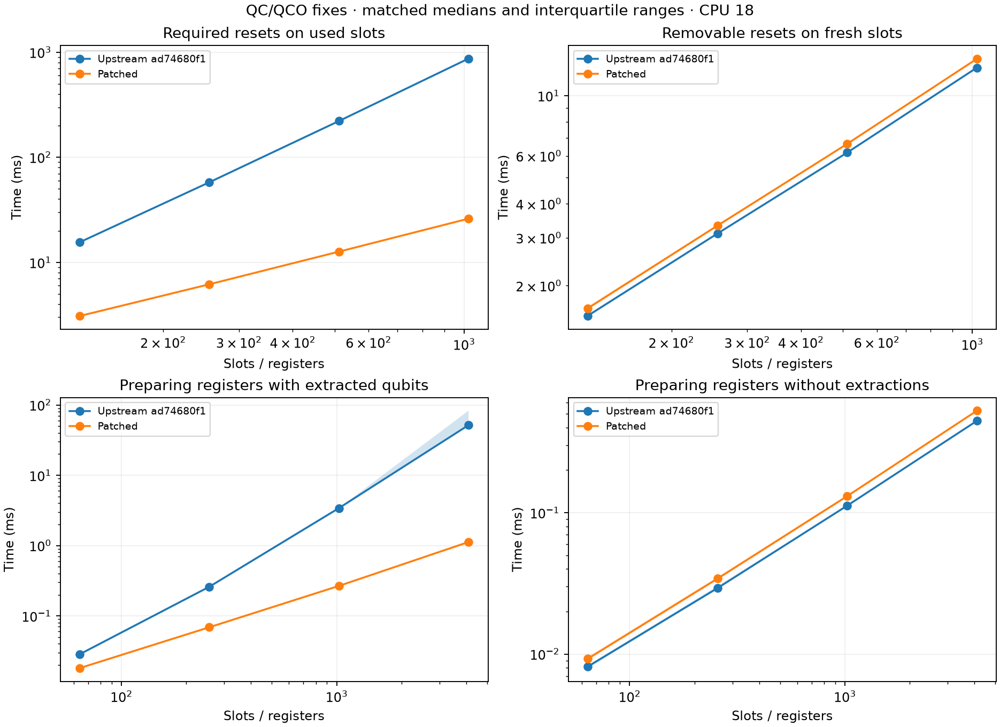

# QC/QCO pre-release evidence for #2253

Upstream baseline: `ad74680f1ef380456a1b89a810ef33ee8d218f69`.
Final source: `f0b995a4450e7c93d4ef9141861cda6a1b674fd0` (includes main at `9d6526f48`).
The historical performance-only revision is `37bda5bddf073039f90122d882f6f2eba98a7a38`.
See [the final audit](../../audits/qc-qco-pre-release-2253.md).



## Evidence

- `comparison-pr.json`, `comparison-pr.png`, `environment-pr.json`,
  `determinism-pr.json`, and `tests-pr.json`: final source measurements,
  revisions and hashes, reproducibility checks, and native test results.
- `escaping-index.cpp` and `escaping-index-pr.mlir`: the minimal index-escape
  reproducer and its verified output after the correctness fix.
- `comparison.json`, `comparison.png`, `environment-fixed.json`,
  `determinism-fixed.json`, and `tests-fixed.json`: historical results at
  `37bda5bdd`, before the index-provenance fix. The original
  `escaping-index-*.mlir` and matching logs retain that revision's failure.
- `results.json`, `results.png`, `environment.json`, `tests.json`, and
  `determinism.json`: historical audit evidence at the upstream baseline. The
  `noreset` variant only disabled the old reset pattern; it was never a proposed
  production fix.
- `comparison-shared-host.json`: an earlier complete comparison at `37bda5bdd`
  with large scheduling outliers, retained separately from the repeated series.

## Reproduce the production comparison

Use separate clean checkouts at the two revisions. Copy the committed benchmark
sources into the baseline checkout. In each checkout, use the same LLVM/MLIR
23.1.0 installation and configure the recorded build settings:

```sh
cmake --preset release -B build/release-clang-ipo \
  -DCMAKE_C_COMPILER=/usr/bin/clang-23 \
  -DCMAKE_CXX_COMPILER=/usr/bin/clang++-23 \
  -DCMAKE_LINKER_TYPE=MOLD -DENABLE_IPO=ON
cmake --build build/release-clang-ipo \
  --target mqt-cc mqt-core-mlir-unittest-qco-ir -j8
```

In the baseline checkout:

```sh
python3 .agent/benchmarks/qc-qco-pre-release/build_probe.py baseline
```

Copy that `probe-baseline` executable into the fixed checkout's benchmark
folder. Keep its original build tree available for runtime dependencies. Then,
from the fixed checkout:

```sh
python3 .agent/benchmarks/qc-qco-pre-release/generate.py
python3 .agent/benchmarks/qc-qco-pre-release/build_probe.py fixed
python3 .agent/benchmarks/qc-qco-pre-release/compare.py
python3 .agent/benchmarks/qc-qco-pre-release/plot_comparison.py
```

The build helper uses the compile database and `mqt-cc` link command. NumPy and
Matplotlib are required only for plotting. Generated objects, executables, and
inputs are ignored. `compare.py --builder-only` repeats builder measurements
while retaining existing reset measurements. Both complete recorded comparisons
used full runs. The scripts write the default filenames; the final-source results
are archived with the `-pr` suffix to retain the historical measurements.

## Workloads and limits

- **Determinism:** allocate/H/finalize 16 scalar qubits, or 16 tensors with four
  extracted/H-transformed qubits each. Every module verifies and passes QCO
  linearity. Serialized output must agree across fresh processes.
- **Fresh/used slots:** allocate one tensor and extract/reset/H/reinsert each
  slot. For the used-slot case, first extract/H/reinsert every slot. Time one
  canonicalizer pass, including its verifier. Parsing, copying, final
  verification, linearity, serialization, and hashing are outside timing.
  Both builds emit byte-identical canonical IR. They remove every fresh-slot
  reset and retain every required used-slot reset.
- **Builder preparation:** create N one-slot tensors, optionally extract and H
  each qubit, then time `qcoIf` construction carrying all tensors with an identity
  body. Finalization and verification are outside timing. Both builds use the
  same input for each comparison; the empty case is a distinct workload.

Each comparison alternates variant order across five process pairs. Each process
uses two warmups and three samples. Plots show medians and interquartile ranges,
not confidence intervals. Timings are pinned to CPU 18 with MLIR multithreading
disabled. Local builds, tests, lint, and documentation generation finished before
the final measurements. The host also runs other tasks, including concurrent LLVM/Core builds during the
final-source run; CPU affinity does not isolate the benchmark. Raw spread and the
outlier-heavy preceding run are retained. An earlier CPU 19 attempt was stopped
when another benchmark was observed on that CPU and is not included in the
production comparisons. These microbenchmarks do not establish whole-compiler
speedups or arbitrary-workload guarantees.

## Reproduce the index-escape regression

```sh
python3 .agent/benchmarks/qc-qco-pre-release/build_probe.py upstream-index escaping-index.cpp
python3 .agent/benchmarks/qc-qco-pre-release/build_probe.py fixed-index escaping-index.cpp
.agent/benchmarks/qc-qco-pre-release/probe-upstream-index
.agent/benchmarks/qc-qco-pre-release/probe-fixed-index
```

`upstream-index` is expected to exit **1**, diagnosing an operand that does not
dominate its use. `fixed-index` is expected to exit **0** with verified, linear
IR. The upstream variant compiles the exact baseline builder source and header
against the same dialect libraries; no passes run in this reproducer. The fixed
variant uses the final builder. Normal QCO IR tests cover the fix across branches,
loops, and switches, including unsupported slot/register changes.
