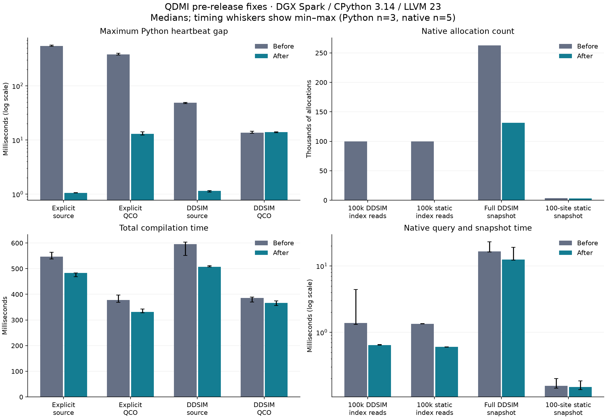

# QDMI pre-release performance measurements

Date: 2026-09-10. These experiments cover the two applied findings in the
[audit](../../audits/qdmi-pre-release-performance-2026-09-10.md).

## Source and environment

- Before: `ad74680f1ef380456a1b89a810ef33ee8d218f69`.
- After: the same baseline with the three source blobs below. These changes
  are retained in commit `5e4e63a084e5cf71658fb2ab0d9f635a3aab15eb`.
- Measured source Git blobs: `register_mlir.cpp`
  `d0a648bac54b6a5872c867c845e857364f647db7`; `Client.hpp`
  `754db9c3de9c1689fd28889b9c7e016adb78df0f`; `test_mlir.py`
  `d76c2243dcc0e4ac05199d20a064bec320f2ed96`.
- ARM64 DGX Spark, Linux `6.17.0-1032-nvidia`, GCC/libstdc++ 13.3.0,
  LLVM/MLIR 23.1.0, CMake Release with IPO, GIL-enabled CPython 3.14.7.
  The Python extension uses the repository's Nox release build.
- Same machine, build settings, workloads, and harness for both variants.
  Runs were sequential, without CPU pinning; host load can affect timing.
  Harness cleanup after collection preserves the measured native call scopes
  and the sample calculation.

## Results and limits

The Python probe compiles approximately 1,000 and 10,000 RX/CX/RZ gates on two
qubits to OpenQASM 3. A second Python thread sleeps for 1 ms between heartbeat
timestamps. The reported gap is the median of three maximum gaps, including
short intervals immediately before and after each call.

| Approximately 10,000 gates | Before gap | After gap |
| --- | ---: | ---: |
| Source, explicit target | 547.912 ms | 1.061 ms |
| Typed QCO, explicit target | 378.974 ms | 12.992 ms |
| Source, open DDSIM device | 48.822 ms | 1.149 ms |
| Typed QCO, open DDSIM device | 13.623 ms | 14.039 ms |

Typed input cloning remains under the GIL. The device/typed case therefore has
no expected improvement: its ranges overlap (13.285–14.451 ms before,
13.724–14.183 ms after). Source/explicit total compilation took 547.163 ms
before and 482.963 ms after. The demonstrated benefit is responsiveness;
these few runs do not establish a general compiler throughput speedup.

The native probe takes five timing samples per workload. It counts calls and
requested bytes through its thread-local `operator new` instrumentation, not
all `malloc` calls or peak memory. Allocation and provider-query counters in
each raw row describe the final repetition.

| Native workload | Before median (min–max) | After median (min–max) | Allocations before → after |
| --- | ---: | ---: | ---: |
| 100,000 DDSIM index reads | 1.376 (1.319–4.395) ms | 0.644 (0.641–0.657) ms | 100,000 → 0 |
| 100,000 static index reads | 1.346 (1.342–1.355) ms | 0.604 (0.600–0.605) ms | 100,000 → 0 |
| Full DDSIM target snapshot | 16.525 (16.144–23.028) ms | 12.417 (12.279–19.120) ms | 262,613 → 131,543 |
| 100-site static snapshot | 0.156 (0.145–0.200) ms | 0.150 (0.137–0.186) ms | 3,271 → 3,071 |

The DDSIM snapshot still queries 65,535 sites, with 327,675 site-property calls
and 487 operation-property calls. It removes 131,070 allocations and 4,063,170
cumulative allocated bytes. Counts depend on libstdc++'s string capacity.
The static snapshot has little timing change, despite removing 200 allocations.

The unchanged operation-factory control remains in the raw data: 1,000 and
10,000 tuples vary slightly upward, while 100,000 tuples vary downward; the
sample ranges overlap. Its allocation counts are unchanged. No new ownership
API was added for this deferred candidate.

Native checksums match the baseline. Five fresh Python processes with hash
seeds `1,17,99,211,937` and differing allocation padding match the baseline
hashes for OpenQASM 3, Base QIR bitcode, and Adaptive QIR bitcode. This is a
bounded output check, not proof for every program. The retained tests also
check native errors, input ownership, and numerical simulation results.



Raw data: [native before](native-before.txt), [native after](native-after.txt),
[Python before](python-before.txt), [Python after](python-after.txt),
[determinism before](determinism-before.txt), and
[determinism after](determinism-after.txt). Python rows include every duration
and maximum gap; native rows include all five sorted timing samples.

## Reproduction

Export the measured source changes from this PR's checkout:

```bash
git diff 5e4e63a^ 5e4e63a -- bindings/mlir/register_mlir.cpp include/mqt-core/qdmi/Client.hpp test/python/test_mlir.py > /tmp/qdmi-pre-release.patch
```

Use separate checkouts of the measurement baseline. Apply the exported patch
to one with `git apply /tmp/qdmi-pre-release.patch`. This retains the measured
base even though the implementation was rebased onto newer upstream commits.
Copy this experiment directory into each checkout at the same relative path.
Run the following from each checkout root. LLVM/MLIR 23 must be discoverable
through the normal CMake package search; no machine-specific paths are needed
on the configured DGX Spark.

```bash
cmake --preset release
cmake --build --preset release --target mqt-core-mlir-unittests-compiler mqt-core-qdmi-test mqt-core-qdmi-ddsim-device-test --parallel 8
uvx nox -s tests-3.14 -- -n0 --no-cov test/python/test_mlir.py test/python/qdmi/test_compilation.py
python3 .agent/benchmarks/qdmi-pre-release-performance/build_probe.py
.agent/benchmarks/qdmi-pre-release-performance/probe
.nox/tests-3-14/bin/python .agent/benchmarks/qdmi-pre-release-performance/gil_probe.py
PYTHONHASHSEED=1 .nox/tests-3-14/bin/python .agent/benchmarks/qdmi-pre-release-performance/determinism_probe.py
```

Repeat the last command for the other four seeds. Redirect each variant's probe
output to its corresponding raw-data file to regenerate the comparison.
`build_probe.py` reuses the compiler test's compile and link commands, including
the native test-provider library paths. No live provider or hardware job runs.

Generate the plot with a separate temporary plotting environment:

```bash
uv run --no-project --with matplotlib==3.11.1 python .agent/benchmarks/qdmi-pre-release-performance/plot.py
```

This directory is excluded from routine lint and normal build/test targets.
The C++ harness was compiled and run; the Python probes were run and explicitly
syntax-checked. The plot was regenerated and visually inspected. See the audit
for production validation and platform limits.
