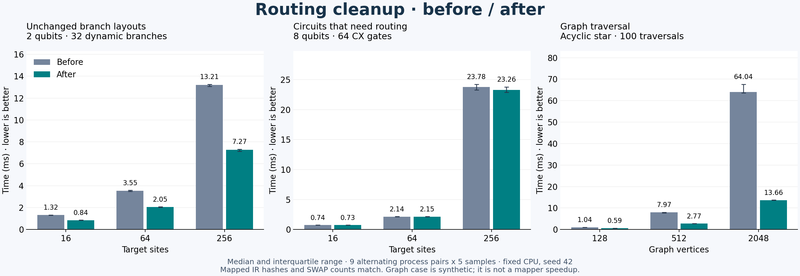

# Routing cleanup benchmarks

Compare upstream main `91a9e0ba514af938680cdd394d6d63195872dc9a` with the
routing changes in this PR. The same benchmark source and build settings were
used for both executables.



| Workload            |          Size | Before (ms) | After (ms) |
| ------------------- | ------------: | ----------: | ---------: |
| Unchanged branches  |      16 sites |       1.320 |      0.845 |
| Unchanged branches  |      64 sites |       3.545 |      2.053 |
| Unchanged branches  |     256 sites |      13.208 |      7.266 |
| Routing             |      16 sites |       0.737 |      0.733 |
| Routing             |      64 sites |       2.140 |      2.146 |
| Routing             |     256 sites |      23.783 |     23.259 |
| Graph, 100 searches |  128 vertices |       1.044 |      0.587 |
| Graph, 100 searches |  512 vertices |       7.967 |      2.766 |
| Graph, 100 searches | 2048 vertices |      64.042 |     13.656 |

Unchanged branches are 1.56–1.82 times faster. Routing times differ by less than
3%; this experiment does not establish an improvement for that workload.

## Workloads and limits

- **Unchanged branch layouts:** two active qubits, one measurement, and 32
  dynamic conditionals containing X gates, on square targets with 16, 64, and
  256 sites. No SWAPs are required. This isolates unchanged region boundaries;
  it is not representative of every adaptive program.
- **Circuits that need routing:** eight active qubits and 64 CX gates with
  varying partners on the same target sizes. The mapper emits 39, 50, and 53
  SWAPs respectively. This checks for a cost change when branch repair is
  absent.
- **Graph traversal:** 100 cycle searches on an acyclic star with 128, 512, or
  2048 vertices. This exposes repeated adjacency copying at high degree. It is a
  synthetic helper benchmark, not a mapper speedup on a typical coupling graph.

The mapping interval includes `PassManager::run`, including its verifier. Input
construction, cloning, output verification, SWAP counting, and printing are
outside the interval. Each process discards one warmup per workload and records
five samples. Nine process pairs alternate execution order. The figure shows
medians and interquartile ranges over the 45 samples per variant and workload;
these are sample spread, not confidence intervals or 45 independent processes.
All mapped-IR hashes and SWAP counts match across variants and repetitions. The
mapper uses seed 42, one trial, one refinement iteration, and its default
lookahead and cost weights. MLIR multithreading is disabled in the benchmark.

Measured on DGX Spark (ARM64), pinned to CPU 0, GCC 13.3.0, LLVM/MLIR 23.1.0,
release preset with IPO disabled. This is local evidence, not hosted CI or a
claim about all CPUs or circuits. Build and lint processes were stopped before
the recorded measurement run.

## Reproduce

The optional executable lives under
`mlir/unittests/Dialect/QCO/Transforms/Mapping/benchmark_mapping.cpp`. It is
excluded from the default build and from CTest.

Create a detached checkout at the baseline and copy only the benchmark source
and its CMake target into that checkout. Configure both checkouts with the same
compiler and dependency versions:

```sh
cmake --preset release -DBUILD_MQT_CORE_MLIR=ON -DBUILD_MQT_CORE_TESTS=ON \
  -DBUILD_MQT_CORE_BINDINGS=OFF -DCMAKE_INTERPROCEDURAL_OPTIMIZATION=OFF
cmake --build --preset release --target mqt-core-mlir-benchmark-mapping
```

Copy the resulting executables to distinct paths before rebuilding either
checkout. From this directory, collect and render the results:

```sh
taskset -c 0 python3 collect.py /path/to/before-binary /path/to/after-binary
uv run plot.py
```

`collect.py` checks output equivalence before replacing `results.csv`. `plot.py`
declares its plotting dependency through uv script metadata. Plotting adds no
project dependency. `results.csv` preserves every recorded sample.
