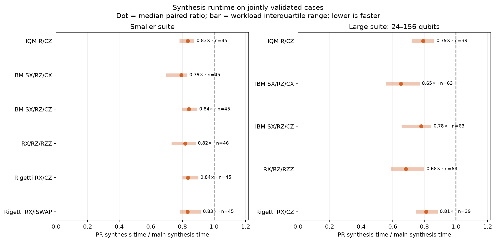
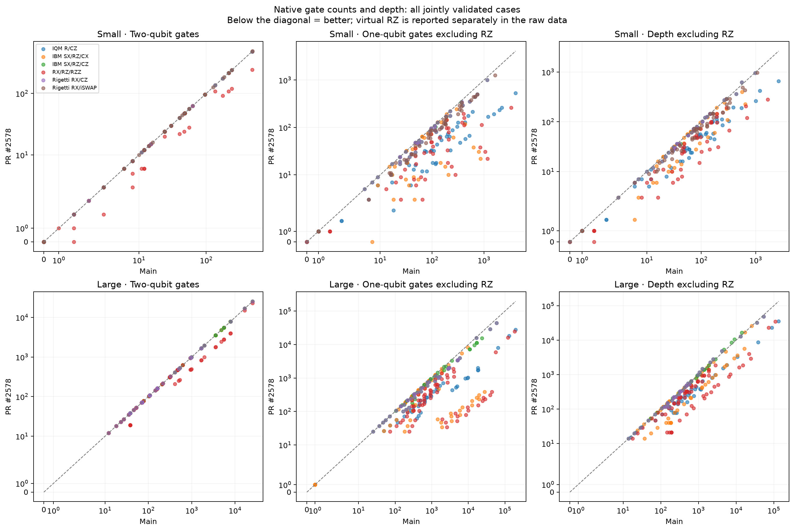
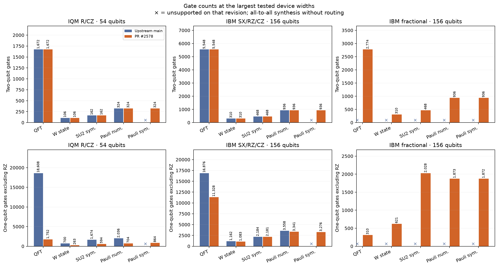
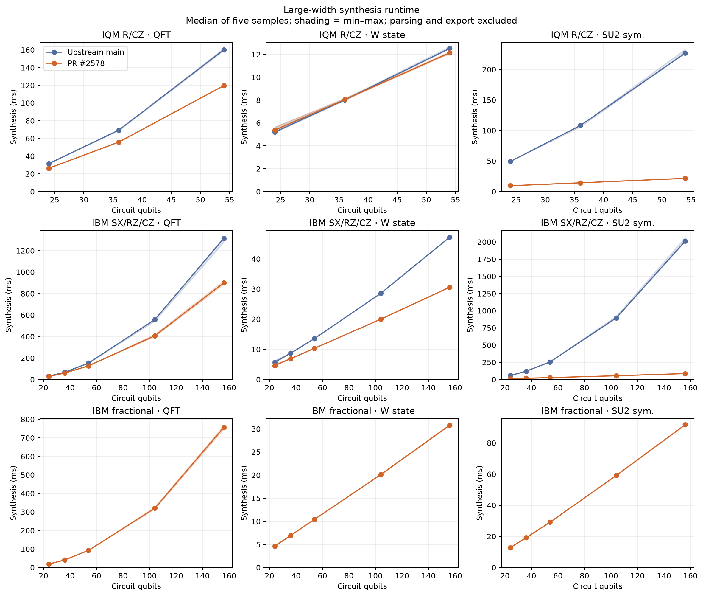
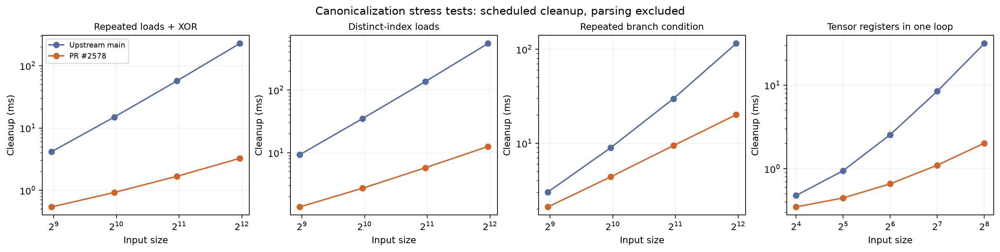

🤖 *AI text below* 🤖

# Synthesis and canonicalization comparison

The [reproduction archive](reproduction.zip) contains frozen inputs, all final raw results, per-worker metadata and binary hashes, harnesses, diagnostic probes, and source patches. Plots are also available as SVG and PDF beside the PNG files.

Baseline: `32f1b331430ce4d580e2780f6fa63e60f6b9a0a3`. PR implementation: [`c9123b11e`](https://github.com/munich-quantum-toolkit/core/commit/c9123b11eb3aa3c12e585744d49b7f6e9377df99). The archive retains the exact measured source patch. The final commit adds only lint fixes (explicit null checks, static helper namespace placement, initializer commas and comments) and validation documentation; the final code was rebuilt and retested.

Each synthesis timing is the median of five samples after one warmup, pinned to CPU 5 with library thread counts fixed to one. Main and branch run in alternating order. Compiler-overlap attempts are excluded and retained separately. Parsing, copying, and Qiskit export are outside synthesis timing.

The small suite uses Core reference-output samples, phase-sensitive matrices, or seeded statevector checks. Large-width cases check native gate and angle contracts only; they do not establish full-circuit equivalence. All targets use all-to-all connectivity, so the study excludes routing and hardware execution. Approximation policies differ between main and the PR; improvements are not all exact gate identities.

| Suite | Main validated exports | PR validated exports | Common pairs |
|---|---:|---:|---:|
| small | 271 | 400 | 271 |
| large | 267 | 398 | 267 |

Relative to the previous PR head, the symbolic three-axis Cartan witness drops from four to three fixed entanglers. This prioritizes two-qubit count: IQM uses 12 R gates instead of eight in that witness. The cross-pair diagonal inverse witness drops from six to two CZ gates. These diagnostics are separate from the frozen suites; raw phase-sensitive results are in `cartan-new.jsonl` and `diagonal-new.jsonl`.

| Suite / target | Common pairs | Median runtime ratio PR/main | 2Q gates lower / same / higher |
|---|---:|---:|---:|
| small / IQM R/CZ | 45 | 0.834 | 0 / 45 / 0 |
| small / IBM SX/RZ/CX | 45 | 0.793 | 0 / 45 / 0 |
| small / IBM SX/RZ/CZ | 45 | 0.840 | 0 / 45 / 0 |
| small / RX/RZ/RZZ | 46 | 0.817 | 17 / 29 / 0 |
| small / Rigetti RX/CZ | 45 | 0.835 | 0 / 45 / 0 |
| small / Rigetti RX/iSWAP | 45 | 0.832 | 0 / 45 / 0 |
| large / IQM R/CZ | 39 | 0.792 | 0 / 39 / 0 |
| large / IBM SX/RZ/CX | 63 | 0.652 | 0 / 63 / 0 |
| large / IBM SX/RZ/CZ | 63 | 0.779 | 0 / 63 / 0 |
| large / RX/RZ/RZZ | 63 | 0.684 | 23 / 40 / 0 |
| large / Rigetti RX/CZ | 39 | 0.811 | 0 / 39 / 0 |

No common case increases two-qubit count, two-qubit depth, or physical single-qubit count. Six smaller and sixteen large cases increase depth excluding RZ; the largest is 17.3% for 156-qubit QPE on IBM CZ (14,083 to 16,513). This tradeoff predates this round: all 398 large-case gate counts and depth metrics match the previous PR evaluation. No paired synthesis-runtime median regresses by more than 10%.

The canonicalization stress tests reduce the 4,000-load chain from 227 ms to 3.27 ms, distinct-index loads from 553 ms to 12.6 ms, repeated-condition branches from 115 ms to 20.2 ms, and scalarization of 256 tensor registers from 31.6 ms to 2.02 ms. These are cleanup microbenchmarks, not end-to-end synthesis speedups.

Ratios below one are improvements. Ratios exclude unsupported or unvalidated cases and zero baseline denominators. Workload distributions are not confidence intervals. See `plots/summary.json` for every gate-count and runtime regression, and `plots/raw_results.csv` for all rows.

