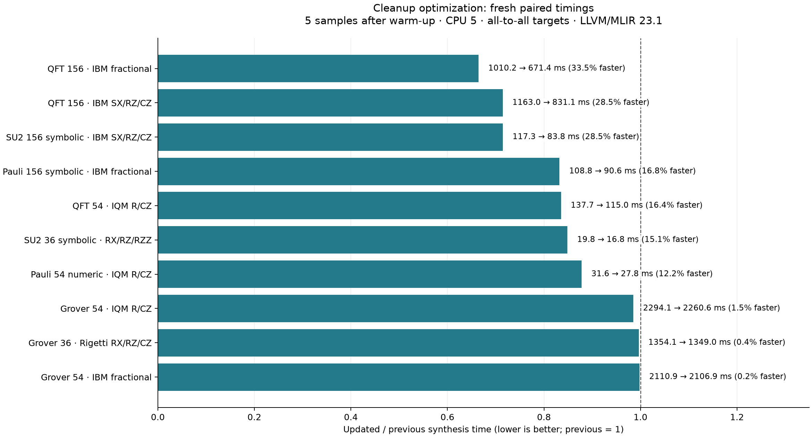
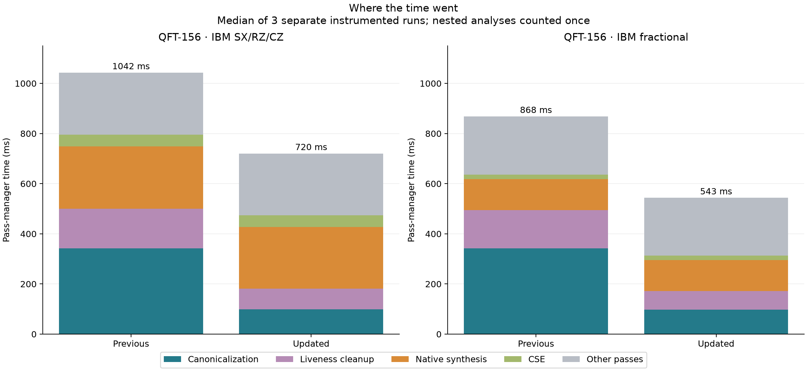
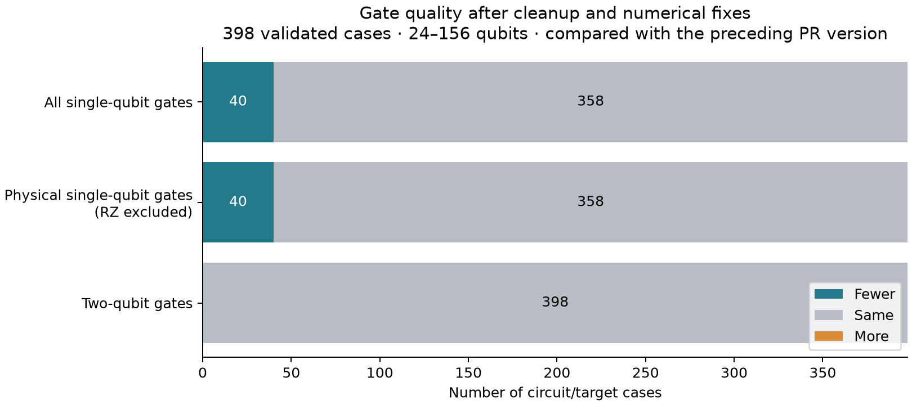

🤖 *AI text below* 🤖

# Synthesis cleanup and regression audit

Core implementation: `02103652062415d71c8428d91e8bd927ad1993b2`. The fresh paired baseline is the preserved binary for `cdf609911`; the subsequent `9fcefeeac` commit changed tests only. Upstream main remains `32f1b3314`. This evaluation follows the [previous results](https://github.com/munich-quantum-toolkit/core/blob/2cf45656db38d1a2726d633ec2ad2721756bd293/refined-20261004/report.md).

## What changed

1. **Numerical gate noise:** Euler emission used the `1e-15` capability-comparison tolerance on angles reconstructed from matrices. Roundoff could miss a one-SX shortcut or retain a negligible local rotation. Emission now uses the existing matrix tolerance, `1e-14`; fixed target capabilities and the nonlocal fidelity policy are unchanged. W-36 on IBM CX drops from 181 to 175 SX gates; IQM drops from 175 to 173 R gates. Multiplexer-24 retains its reduction from 46 to 38 CX gates and now uses 25 SX instead of 26. Existing near-Clifford tests now exercise matrix-scale roundoff.

2. **Repeated canonicalization work:** the constant-index tensor-chain pattern repeatedly commuted inserts through extracts before folding a reused slot. Temporary rewrite-listener instrumentation on QFT-156 counted 24,178 successful chain rewrites and 1,290,695 extract-fold attempts. The existing pattern now forwards repeated slots during one traversal, then moves the remaining inserts once. The same input needs one successful chain rewrite and 313 extract-fold attempts. Dynamic indices, block boundaries, graph-region order, and qubit identity remain guarded.

3. **Repeated liveness analysis:** target pipelines previously removed dead values both before and after placement. They now defer this analysis until after placement. Generic QCO cleanup retains its existing behavior. The final pass remains because placement changes region signatures; the structured-control-flow fixed-point test and the full compiler suite pass.

Canonicalizer settings were checked before changing patterns. On the unchanged QFT input, one module iteration already produced the same normalized IR as unlimited iterations. Top-down traversal was slower for the original chain pattern. Reducing the iteration cap would not fix the repeated worklist activity and could truncate nested control-flow cleanup, so the convergence settings stay unchanged. No new canonicalizer pass or pattern whitelist was added. The distinction between rewrite traversal and module iterations follows [MLIR’s greedy rewrite configuration](https://github.com/llvm/llvm-project/blob/main/mlir/include/mlir/Transforms/GreedyPatternRewriteDriver.h); full dead-value analysis performs broader function/region-signature cleanup than local DCE ([implementation](https://github.com/llvm/llvm-project/blob/main/mlir/lib/Transforms/RemoveDeadValues.cpp)).

## Fresh paired runtime measurements

Five timed samples after a warm-up, alternating before/after order by case. These are end-to-end synthesis calls; import, source copying, export, counting, and validation are outside the synthesis timer. Sample max/min ratios are at most 1.05. Changes below a few percent should be treated as essentially unchanged.

| Circuit | Target | Previous (ms) | Updated (ms) | Median reduction |
|---|---|---:|---:|---:|
| core_grover_36 | rigetti_rx_cz | 1354.1 | 1349.0 | 0.4% |
| core_grover_54 | ibm_fractional_bounded | 2110.9 | 2106.9 | 0.2% |
| core_grover_54 | iqm_r_cz | 2294.1 | 2260.6 | 1.5% |
| core_qft_156 | ibm_fractional_bounded | 1010.2 | 671.4 | 33.5% |
| core_qft_156 | ibm_sxz_cz | 1163.0 | 831.1 | 28.5% |
| core_qft_54 | iqm_r_cz | 137.7 | 115.0 | 16.4% |
| efficient_su2_156_symbolic | ibm_sxz_cz | 117.3 | 83.8 | 28.5% |
| efficient_su2_36_symbolic | rxrz_rzz_unbounded | 19.8 | 16.8 | 15.1% |
| pauli_layers_156_symbolic | ibm_fractional_bounded | 108.8 | 90.6 | 16.8% |
| pauli_layers_54_numeric | iqm_r_cz | 31.6 | 27.8 | 12.2% |

## Cleanup cost

On QFT-156 / IBM CZ, the two canonicalizers together fall from 342.5 to 98.5 ms; dead-value cleanup falls from 157.5 to 83.0 ms. Native synthesis is essentially unchanged at 249.0 versus 246.3 ms. The fractional target shows the same cleanup savings. On symbolic SU2-156 / IBM CZ, canonicalization falls from 33.0 to 7.5 ms and liveness cleanup from 13.7 to 6.6 ms.

Grover starts compact and expands during decomposition, so its early liveness pass was already cheap. The retained late liveness pass still costs about 326 ms for Grover-54 / IQM; native synthesis costs about 1,197 ms. These changes therefore do not materially accelerate Grover. Removing the remaining liveness pass unconditionally would break structured-control-flow cleanup; this patch removes the redundant invocation and retains MLIR’s standard scheduling.

## Gate quality and the meaning of “free RZ”

All 398 large circuit/target combinations export and satisfy native gate/angle constraints. Against the immediately preceding version, 40 cases use fewer total and physical single-qubit gates and 358 are unchanged. No case gains single- or two-qubit gates; all two-qubit counts and depths are unchanged. Total depth increases by one in three numeric Pauli-layer cases: IQM-36 (439→440), IBM CZ-36 (1082→1083), and Rigetti-24 (722→723). The IQM case has no native RZ, so this residual depth difference is real, although small.

Against the older pre-refinement measurements, all 12 total-single-qubit-count regressions disappear; physical-single-qubit regressions decrease from 38 to 14 cases. The largest remaining relative increase is symbolic SU2-24 / unrestricted RZZ, 237→240 physical rotations. A freshly rebuilt older source reproduces that difference. Its depth excluding RZ changes from 146 to 149; bounded fractional SU2 changes from 149 to 151, and IonQ from 150 to 153. These are local-decomposition choices, not merely virtual-gate accounting. The generic Weyl path can choose different local factors when specialization is enabled, and total gate reductions need not minimize physical depth. This patch adds no target-specific exceptions to chase three rotations.

Some historical W-state count differences do not reproduce after rebuilding the older source: the rebuilt version already uses 181 SX, like the pre-fix current binary. The matrix-tolerance change removes that numerical sensitivity. Treat these historical integer-count differences separately from reproducible source-policy changes. Raw isolation results and both source/binary identities are included.

## Validation and limits

- Core: 3,922 C++ tests passed, one existing job-ID test skipped; all 791 Python MLIR/Qiskit tests passed; repository lint and whole-file C++ lint passed. Existing tests were strengthened rather than adding a new suite.
- All 400 smaller semantic/export cases passed using full matrices, sampled statevectors, or benchmark output references, as appropriate.
- The 398 large cases check native contracts, including three parameter bindings for symbolic circuits. They are not full-width semantic-equivalence proofs.
- Bench’s optional integration session passes all 180 cases against the new exact Core pin; all 269 benchmark tests, repository lint, and uv lock validation also pass.
- DGX Spark arm64, LLVM/MLIR 23.1, Release/O3/LTO, Python 3.14.7, Qiskit 2.5.2, NumPy 2.5.3, CPU 5, one thread. All targets are all-to-all synthesis contracts: no routing, calibration model, or device execution.
- The full quality sweep uses one timing sample per case only as a diagnostic; its timings are not used for performance claims. Runtime figures use the separate five-sample paired experiment; pass figures use three separate instrumented repetitions.

[Raw data and reproduction bundle](cleanup-evaluation.zip) · [Summary JSON](plots/summary.json) · [Source and binary identities](source-verification.json)
