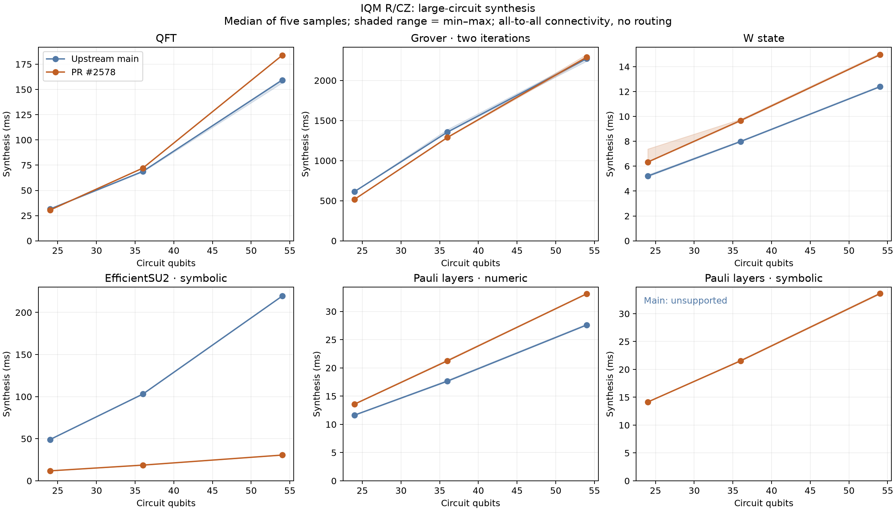
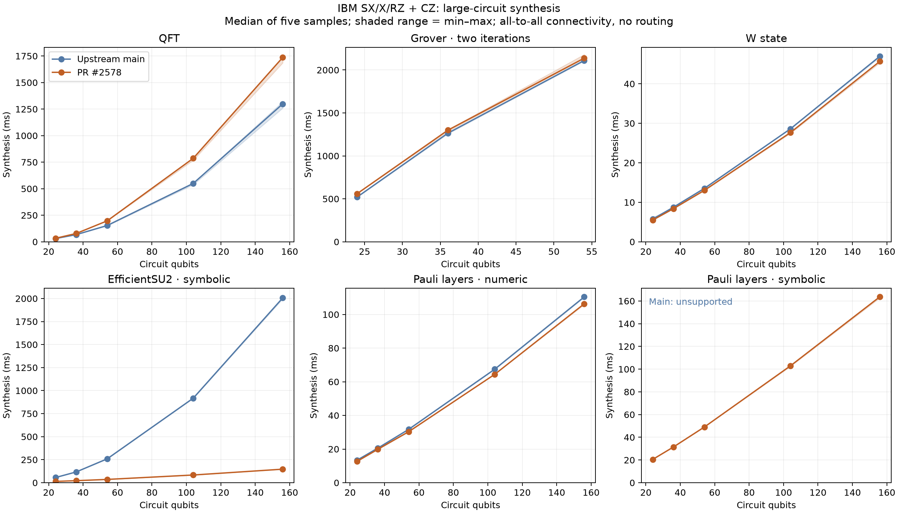
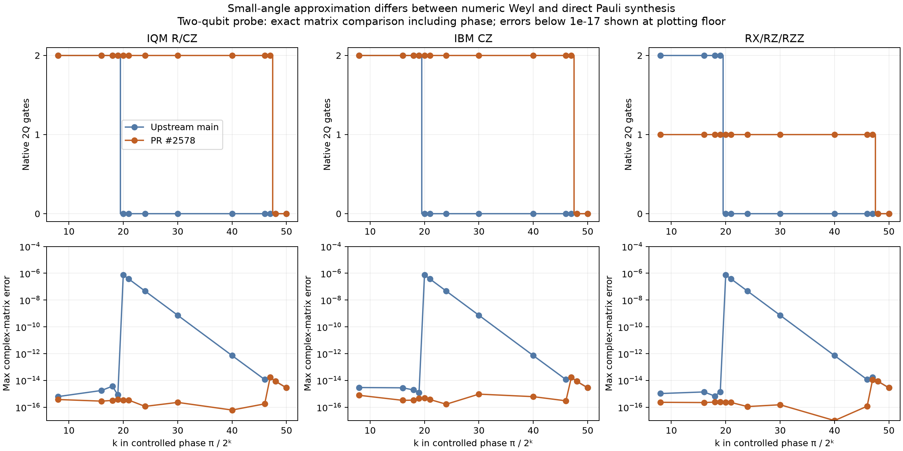
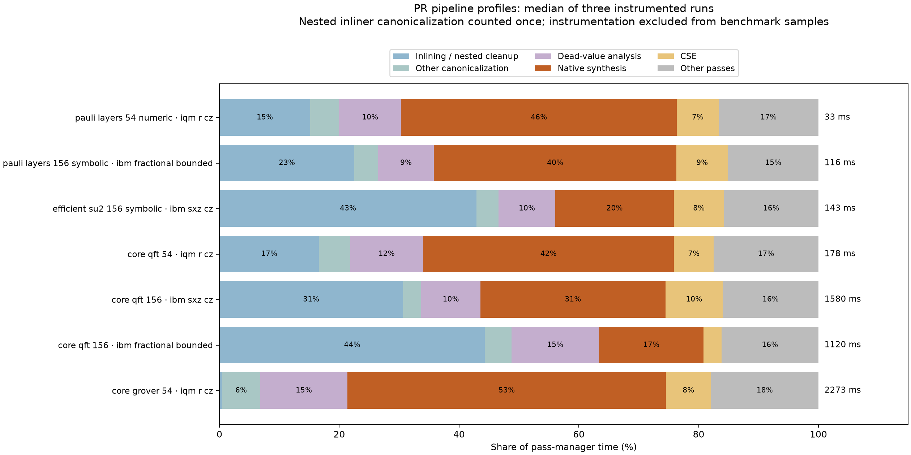
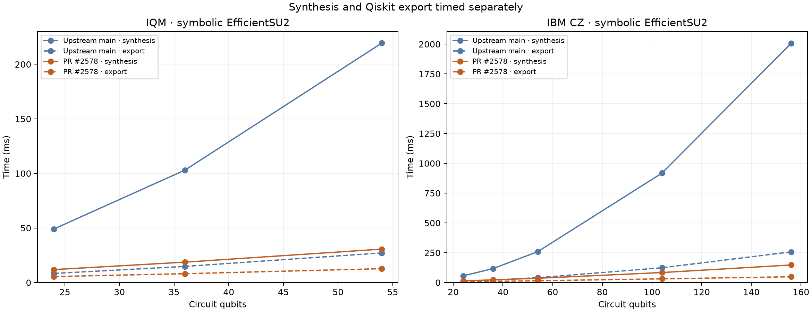
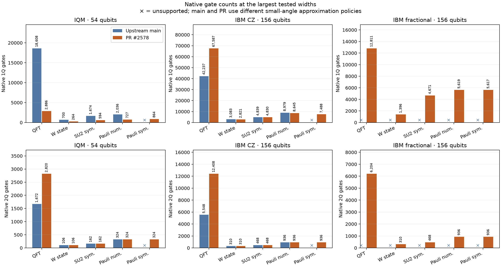

🤖 *AI text below* 🤖

# Large-circuit synthesis: 24–156 qubits

The larger sweep confirms strong symbolic scaling gains, and exposes a gate-count regression on circuits with many tiny rotations. **398/398 PR circuit/target combinations compiled, exported, and passed native-contract checks, versus 267/398 on main.** All compilation workers completed within their limits. These checks establish native gate/angle conformance; they do not prove full-width semantic equivalence.

The comparison uses the same Release synthesis binaries and upstream main revision `32f1b3314` as the earlier experiment. The PR implementation is published in `a5c029272`; current head `a00a2d8c0` changes DD evaluation and tests, not synthesis. Measurements were taken on 2026-10-04. The [method and reproduction instructions](README.md) give exact revisions, binary hashes, constraints, and exclusions.

There are 68 frozen inputs: eight Core benchmark families and six numeric/symbolic kernels at 24, 36, 54, 104, and 156 qubits. IQM, IonQ, and fixed-RX/CZ contracts stop at 54; IBM and unrestricted RX/RZ/RZZ extend to 156. Grover stops at 54 because Core's generator limits it to 62. Targets have all-to-all connectivity: this isolates synthesis and excludes routing, calibration, and hardware fidelity.

| Workload | Main synthesis | PR synthesis | Result |
| --- | ---: | ---: | --- |
| IQM, symbolic EfficientSU2, 54 qubits | 219.41 ms | 30.61 ms | 7.2× faster; 1Q gates 1,674 → 594 |
| IBM CZ, symbolic EfficientSU2, 156 qubits | 2,006.61 ms | 147.20 ms | 13.6× faster; 2Q gates remain 468 |
| IQM, numeric Pauli layers, 54 qubits | 27.60 ms | 33.13 ms | 20% slower; 1Q gates 2,036 → 727 |
| IQM, Grover, 54 qubits | 2,272.55 ms | 2,290.55 ms | Similar runtime; 1Q gates 196,070 → 27,720 |
| IQM, QFT, 54 qubits | 159.30 ms | 183.80 ms | 2Q gates 1,672 → 2,820 |
| IBM CZ, QFT, 156 qubits | 1,298.87 ms | 1,736.68 ms | 2Q gates 5,548 → 12,408 |
| IBM fractional, QFT, 156 qubits | Unsupported contract | 1,278.92 ms | 6,204 RZZ gates |
| IBM fractional, symbolic Pauli layers, 156 qubits | Unsupported contract | 117.87 ms | 936 entanglers; bounded angles pass checks |

**The first priority is a consistent approximation policy.** Main's numeric Weyl path and the PR's direct Pauli path use different effective thresholds. For `CP(pi / 2^20)`, main emits no entangler, with maximum complex-matrix error `7.49e-7`; the PR emits two CZ gates, with error `4.74e-16`. The PR still emits two entanglers at exponent 47 and none at 48. Wide QFT, QPE, multiplexer, and arithmetic circuits contain many such rotations. Among 267 paired successful cases, 59 have more two-qubit gates on the PR; the earlier small sweep did not reveal this. A shared, explicit approximation policy would make constant Pauli and Weyl synthesis consistent. Match the accepted error before comparing their gate counts; do not silently discard additional angles or weaken symbolic contracts.

The relevant paths are [direct Pauli emission](https://github.com/munich-quantum-toolkit/core/blob/a00a2d8c0eb7fde8e36b8372bfd5acfc912bc78d/mlir/lib/Dialect/QCO/Transforms/NativeSynthesis/TargetSynthesis.cpp#L1107) and [Weyl's default fidelity](https://github.com/munich-quantum-toolkit/core/blob/a00a2d8c0eb7fde8e36b8372bfd5acfc912bc78d/mlir/include/mqt/Dialect/QCO/Transforms/Decomposition/Weyl.h#L44).

**Diagonal frame propagation can also help IBM and other CZ targets.** A separate native IBM probe alternates `RZ` on one qubit with CZ gates to distinct neighbors. The PR retains 53 RZ gates at 54 qubits and 155 at 156; commuting these rotations through CZ requires only one RZ, with the same entanglers. The three-qubit version has zero observed full-matrix difference. This is a concrete missed simplification, independent of approximation. It reduces compiler/export work and instruction count; RZ is virtual, so it does not imply the same reduction in physical gate duration. The existing [frame implementation](https://github.com/munich-quantum-toolkit/core/blob/a00a2d8c0eb7fde8e36b8372bfd5acfc912bc78d/mlir/lib/Dialect/QCO/Transforms/NativeSynthesis/ZFramePropagation.cpp#L90) is currently invoked for the equatorial basis. Generalizing its commuting-frame portion is worth prioritizing. The achievable reduction on complete QFT circuits has not been measured.

**Cleanup and verification deserve attention alongside decomposition.** Three independent instrumented runs give these median shares of pass-manager time:

- IBM CZ QFT-156: native synthesis 31%; inliner/nested canonicalization 31%; dead-value analysis 10%; CSE 10%.
- IBM fractional QFT-156: native synthesis 17%; inliner/nested canonicalization 44%; dead-value analysis 15%.
- IQM Grover-54: native synthesis 53%; dead-value analysis 15%; multi-control decomposition 9%.
- IQM numeric Pauli layers-54: native synthesis 46%, up from about 30% on main. Its extra synthesis time accompanies substantially fewer one-qubit gates.

Pass timings include MLIR verification and must not be read as pure algorithm-body timings. Nested inliner timing is counted once. The [target compilation pipeline](https://github.com/munich-quantum-toolkit/core/blob/a00a2d8c0eb7fde8e36b8372bfd5acfc912bc78d/mlir/lib/Compiler/TargetCompilation.cpp#L246) and final native cleanup repeatedly traverse large IR. Measure opportunities to combine or narrow these traversals; the data does not justify simply deleting correctness checks or skipping the inliner's cleanup.

**Keep the parameter-metadata verification optimization.** Much of the symbolic speedup comes from this existing PR change, not fewer entanglers. On the same 156-qubit/1,248-parameter input, a SymbolDCE-only diagnostic leaves the IR unchanged but takes 106.0 ms on main and 4.16 ms on the PR. At 24 and 54 qubits the corresponding times are 2.98/0.59 ms and 13.32/1.34 ms. Main repeatedly checks input names and identities against other arguments and operations; the PR consolidates those checks. Full compilation invokes verification repeatedly, amplifying the cost. This supports retaining the [metadata-check change](https://github.com/munich-quantum-toolkit/core/blob/a00a2d8c0eb7fde8e36b8372bfd5acfc912bc78d/mlir/lib/Dialect/MQT/IR/MQTDialect.cpp#L595). Qiskit export of symbolic EfficientSU2-156 also improves from 257.1 to 48.5 ms.

**Unused device capacity and memory were not material bottlenecks here.** A 24-qubit symbolic circuit takes 11.73/11.69 ms on 24-/54-qubit IQM targets, and 13.97/14.16 ms on 24-/156-qubit IBM CZ targets. These small differences do not support a capacity-specific optimization. Peak worker RSS is 848 MiB on main and 811 MiB on the PR; this includes Python, compilation, export, and validation. These bounds apply to the tested all-to-all contracts, not routing on physical topologies.

Main's 131 unsuccessful cells comprise 68 unrepresentable bounded contracts and 63 synthesis failures. The PR has no synthesis, export, or native-contract failures. Aggregate paired median synthesis ratios are 0.947 for IBM CX, 0.994 for IBM CZ, 0.985 for IQM, 0.987 for fixed-RX/CZ, and 0.962 for RX/RZ/RZZ. These medians conceal the important workload-specific gains and regressions above.

Each timing uses one warm-up and five samples on CPU 5 of a DGX Spark, with one thread and matching Python 3.14.7/Qiskit 2.5.2/NumPy 2.5.3 environments. Shaded ranges show minimum–maximum samples, not confidence intervals. Parsing, cloning, export, and validation are excluded from synthesis timing. Worker limits are 180 seconds and 12 GiB of virtual memory.

Validation is deliberately bounded. Native aliases, arity, fixed parameters, and angle bounds are checked on every output; symbolic circuits use three bindings. The tiny-angle and three-qubit frame probes use full complex matrices including phase. Eight additional wide Core/DD sampling checks pass, including 156-qubit fractional QPE; two 30-second sampling checks time out (IBM CZ QPE-156 and fractional QFT-adder-156). Their compilation succeeded. These simulation timeouts are neither compiler failures nor evidence of equivalence. No full-width statevector/unitary proof is claimed.

The measured data and script entry points are in [README.md](README.md), [raw_results.csv](plots/raw_results.csv), [summary.json](plots/summary.json), and [pass_profiles.json](plots/pass_profiles.json). The recommended order is: align approximation semantics, generalize diagonal-frame merging for native RZ/CZ, then reduce measured cleanup/traversal overhead while preserving validation.
