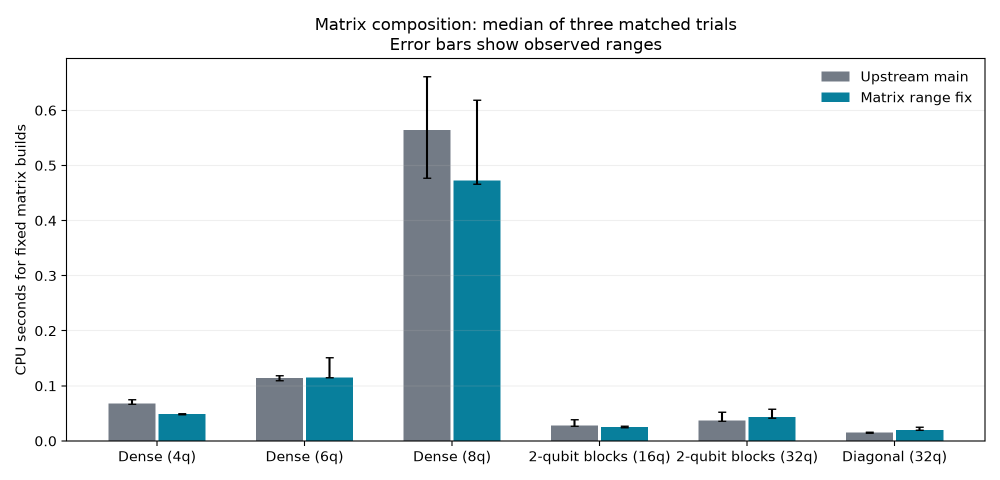
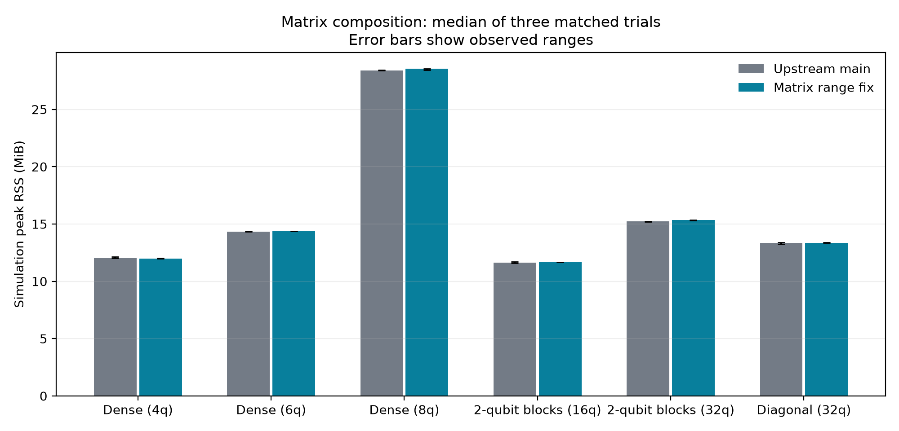
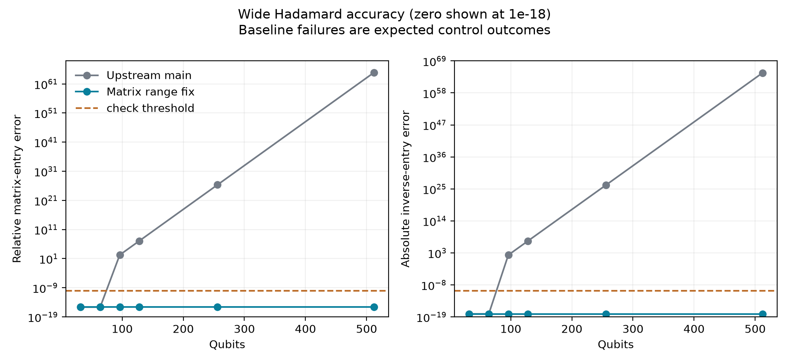

🤖 *AI text below* 🤖

# Matrix root-range evaluation

Baseline: `e7b37b7a42291a9816b735ef8ae2e53b0f37b990`. These 48 fresh processes evaluate the isolated matrix root-range fix: 36 ordinary-scale performance processes and 12 accuracy controls.
Candidate revision: `15c106305557faeefa9c9f6d7f56e7ebf0c77269`; diff against the baseline SHA256: `d923c7331c1f9c860bf1874543a434e2e6db0d3f7f09fa96e9efdc644605bd45`.

All 36 ordinary-scale processes passed their independent numerical checks. The candidate passed all six wide-Hadamard accuracy checks; upstream passed two and failed the four expected controls. No process failed or reached its cap.

CPU and RSS cover fixed repeated functionality builds, including gate construction and GC. RSS is captured before independent reference validation. Ranges are the three observed trials, not confidence intervals. Ratios use matched repetitions; incomplete cases have no performance ratio. See [the evaluation method](matrix-evaluation-method.md) for the oracles and limits.

| Case | Baseline CPU s | Candidate CPU s | Paired CPU ratio | Baseline / candidate MiB | Paired RSS ratio |
|---|---:|---:|---:|---:|---:|
| Dense (4q) | 0.067906 | 0.048780 | 0.717 | 12.00 / 11.99 | 0.999 |
| Dense (6q) | 0.114154 | 0.115328 | 1.053 | 14.35 / 14.36 | 1.001 |
| Dense (8q) | 0.564367 | 0.472757 | 0.935 | 28.41 / 28.54 | 1.005 |
| 2-qubit blocks (16q) | 0.028326 | 0.025019 | 0.883 | 11.61 / 11.66 | 1.004 |
| 2-qubit blocks (32q) | 0.036840 | 0.043109 | 1.143 | 15.21 / 15.33 | 1.008 |
| Diagonal (32q) | 0.015315 | 0.020066 | 1.357 | 13.36 / 13.33 | 0.998 |

Runtime effects are mixed. Median paired CPU ratios range from 0.717 to 1.357 (candidate divided by upstream); RSS ratios range from 0.998 to 1.008. The 32-qubit diagonal case is slower: median CPU rises from 0.015315 s to 0.020066 s, with a median paired ratio of 1.357. This cohort does not establish a general speedup. The three observed trials include short workloads, so their ranges and absolute times matter alongside ratios.

## Wide Hadamard accuracy

These runs check analytic entries and a sequential inverse. Upstream fails at the tested widths 96, 128, 256 and 512; runtimes for those incorrect results are not compared. Entry errors are relative to the analytic signed amplitude and inverse errors are absolute.

| Qubits | Variant | Relative entry error | Inverse entry error | Numerical pass | Expected pass |
|---|---|---:|---:|---|---|
| 32 | upstream | 2.22e-16 | 0 | True | True |
| 32 | candidate | 2.22e-16 | 0 | True | True |
| 64 | candidate | 2.22e-16 | 0 | True | True |
| 64 | upstream | 2.22e-16 | 0 | True | True |
| 96 | upstream | 180 | 180 | False | False |
| 96 | candidate | 2.22e-16 | 0 | True | True |
| 128 | candidate | 2.22e-16 | 0 | True | True |
| 128 | upstream | 1.19e+07 | 1.19e+07 | False | False |
| 256 | upstream | 2.19e+26 | 2.19e+26 | False | False |
| 256 | candidate | 2.22e-16 | 0 | True | True |
| 512 | candidate | 2.22e-16 | 0 | True | True |
| 512 | upstream | 7.45e+64 | 7.45e+64 | False | False |

## Plots

