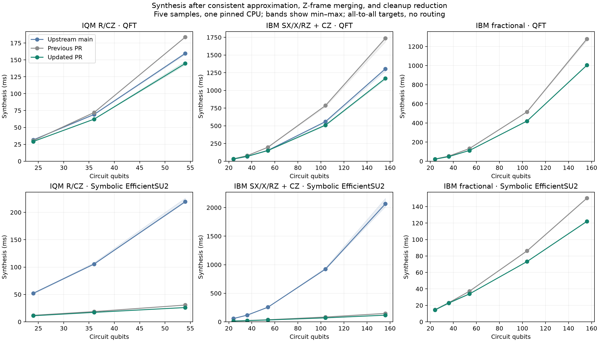
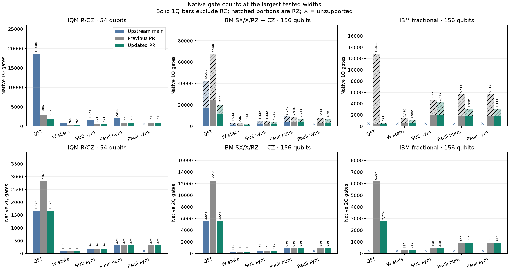
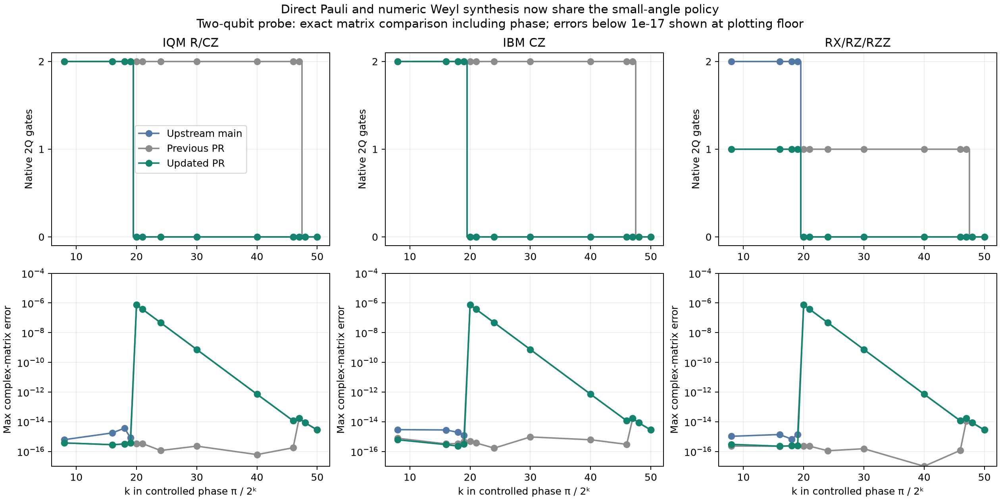
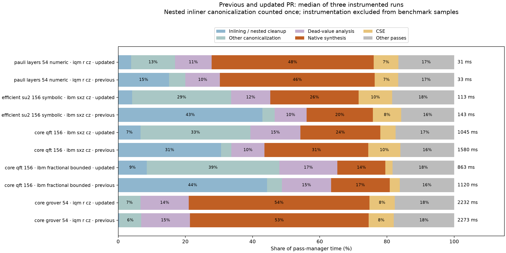

🤖 *AI text below* 🤖

# Native synthesis: approximation, frames, and cleanup

Updated Core PR #2578 reuses the existing Weyl fidelity policy and Z-frame propagation. The evaluation repeats the frozen large-circuit corpus: 68 inputs, 24–156 qubits, and 398 case/target combinations per compiler.

## Changes

- Numeric direct Pauli, fractional, and square-root-iSWAP resynthesis use the existing average gate fidelity floor of `1 - 1e-12` per decomposition. Negligible nonlocal angles may disappear. This is not a whole-circuit error budget; unbound runtime angles remain exact.
- Z-frame propagation also serves native RZ targets. It runs after local fusion to preserve physical-gate quality and leaves isolated native RZ parameters unchanged. Existing barrier, control-flow, phase, and scalar-dominance handling is shared.
- MLIR module cleanup owns canonicalization and dead-symbol removal after inlining. The inliner no longer repeats callable canonicalization. Dead-value analysis after placement remains necessary.

## Representative results

Each cell lists native **1Q / 2Q gates; median synthesis milliseconds**. Main cannot represent the bounded fractional contract. Previous PR times are archived measurements from the earlier experiment, not an interleaved rerun.

| Circuit / target | Upstream main | Previous PR | Updated PR |
|---|---:|---:|---:|
| QFT-54 / IQM | 18,608 / 1,672; 159.6 ms | 2,886 / 2,820; 183.8 ms | 1,752 / 1,672; 144.7 ms |
| QFT-156 / IBM CZ | 42,237 / 5,548; 1305.6 ms | 67,587 / 12,408; 1736.7 ms | 19,458 / 5,548; 1170.9 ms |
| QFT-156 / IBM fractional | target unsupported | 12,811 / 6,204; 1278.9 ms | 621 / 2,774; 1005.0 ms |
| Symbolic SU2-156 / IBM CZ | 4,839 / 468; 2066.2 ms | 4,830 / 468; 147.2 ms | 4,362 / 468; 116.5 ms |
| Symbolic Pauli-156 / IBM fractional | target unsupported | 5,617 / 936; 117.9 ms | 3,119 / 936; 108.8 ms |
| Grover-54 / IQM | 196,070 / 25,392; 2250.8 ms | 27,720 / 25,392; 2290.5 ms | 27,713 / 25,392; 2318.5 ms |

RZ is separated from other one-qubit gates in the count plot because virtual-Z savings do not directly measure physical gate cost.

## Aggregate results and regressions

All 398 updated cases export and satisfy their native gate and angle contracts. Main has 267 validated exports, 68 unsupported-capability cases, and 63 synthesis failures. The previous PR also has 398 valid exports.

Ratios below are medians of per-case updated/baseline synthesis times; lower is faster. Main ratios include only jointly successful cases.

| Target | Cases vs main | Time / main | Cases vs previous | Time / previous |
|---|---:|---:|---:|---:|
| IBM fractional | 0 | — | 68 | 0.917× |
| IBM CX | 63 | 0.791× | 68 | 0.911× |
| IBM CZ | 63 | 0.906× | 68 | 0.925× |
| IonQ fixed R/RZ/RZZ | 0 | — | 42 | 0.922× |
| IQM R/CZ | 39 | 0.905× | 42 | 0.922× |
| Rigetti fixed RX/RZ/CZ | 39 | 0.949× | 42 | 0.947× |
| RX/RZ/RZZ | 63 | 0.819× | 68 | 0.908× |

Gate quality is not monotonic for every circuit. Compared with the previous PR:

- 12/398 cases increase total 1Q gates; largest relative increase: 466 → 472 (1.3%) for `core_w_state_36__ibm_sxz_cx`.
- 38/398 cases increase non-RZ 1Q gates; largest relative increase: 25 → 26 (4.0%) for `core_multiplexer_24__ibm_sxz_cx`.
- No increase in 2Q gates.
- 21/398 cases increase total depth; largest relative increase: 222 → 227 (2.3%) for `efficient_su2_24_symbolic__rxrz_rzz_unbounded`.
- No increase in 2Q depth.

The frame pass itself only commutes or merges native RZ on non-equatorial targets. Small changes to other gates reflect the changed cleanup/fusion order and numerical decompositions. A measured candidate that ran frames before local fusion increased physical RX count by 25% on symbolic fractional Pauli layers; that ordering was rejected. Final regression tests protect physical-gate counts and full matrices.

## Approximation and frame probes

The controlled-phase probe now drops the nonlocal part of `CP(pi/2^20)` on IQM, IBM CZ, and unrestricted RZZ targets. `CP(pi/2^19)` retains its entangler. The maximum full complex-matrix error at the first dropped probe is approximately `7.49e-7`, including global phase. Native gates already accepted by a target remain eligible for preservation; this policy applies to resynthesis.

In a CZ star, the 54- and 156-qubit probes merge 53 and 155 RZ gates respectively into one RZ, retaining every CZ. The three-qubit form is checked against its full matrix.

## Remaining bottlenecks

| Profile | Previous inliner | Updated inliner | Previous pass total | Updated pass total |
|---|---:|---:|---:|---:|
| core_grover_54__iqm_r_cz | 9.1 ms | 1.1 ms | 2272.7 ms | 2232.0 ms |
| core_qft_156__ibm_fractional_bounded | 496.4 ms | 73.5 ms | 1120.3 ms | 863.3 ms |
| core_qft_156__ibm_sxz_cz | 483.9 ms | 69.8 ms | 1579.7 ms | 1044.7 ms |
| efficient_su2_156_symbolic__ibm_sxz_cz | 61.3 ms | 4.7 ms | 142.8 ms | 112.7 ms |
| pauli_layers_54_numeric__iqm_r_cz | 5.0 ms | 1.2 ms | 33.0 ms | 31.3 ms |

These three-run pass profiles include instrumentation and verification overhead; their totals are separate from the uninstrumented benchmark medians. Canonicalization and dead-value analysis remain visible costs. QFT-156 still spends about a third of its pass time in module canonicalization and a further sixth in dead-value analysis. Grover-54 spends about half in native synthesis. The final circuit size and expression conversion also affect Qiskit export. Broader pass-pipeline and exporter changes remain follow-up work.

## Validation and measurement limits

- The complete C++ suite passes 3,922 tests, with one existing job-ID test skipped. All 791 Python MLIR/Qiskit tests pass. Repository lint and whole-file C++ lint pass.
- The separate frozen smaller suite passes all 400 semantic/export cases, using full matrices, sampled statevectors, or benchmark output checks according to circuit size. Small-suite timings are excluded from performance claims.
- Large-width results verify native gate/angle contracts at three bindings for symbolic circuits. They do not prove full-width semantic equivalence. Full statevectors are not feasible at these widths.
- One warmup and five timed samples on CPU 5, one numerical-library thread, DGX Spark ARM64, Release O3/LTO, LLVM/MLIR 23.1, Python 3.14.7, Qiskit 2.5.2. The plots show min–max bands, not confidence intervals.
- Main was measured during the same evaluation; final PR measurements were rerun after a pass-order correction. The previous PR data is historical. Contended timing runs were discarded; the final wide rerun detects compiler activity and retries affected cases. Three pairs with over 30% synthesis-sample spread were repeated on both compilers; originals remain in the archive. Small timing differences can reflect machine noise.
- All-to-all targets isolate synthesis. Routing, calibration fidelity, device scheduling, and hardware execution are excluded. IQM is tested through 54 qubits, IBM contracts through 156.

See [reproduction and provenance](README.md), [raw results](plots/raw_results.csv), [aggregate ratios](plots/summary.json), and [pass profiles](plots/pass_profiles.json). The downloadable archive contains frozen inputs, raw samples, worker metadata, validation output, scripts, source patch, and figures.
